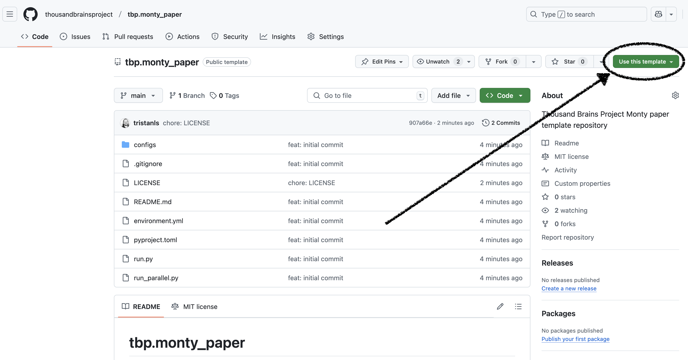

# tbp.monty_paper

This is a template repository for reproducibility code for papers depending on https://github.com/thousandbrainsproject/tbp.monty.

To create a repository from this template, find and click the "Use this template" button:



## Make it yours

After copying the template, you need to address the following TODOs.

### `environment.yml`

- Update project `name`.
- Update `tbptslominski::tbp.monty` version.
- Add any other dependencies.

### `pyproject.toml`

- Update the project `description`
- Update the project `name`
- Update the `Repository` and `Issues` URLs

### `delete_me.png`

- Delete this file

### `README.md`

- Update for your project

## Installation

The environment for this project is managed with [conda](https://www.anaconda.com/download/success).

To create the environment, run:

### ARM64 (Apple Silicon) (zsh shell)
```
conda env create -f environment.yml --subdir=osx-64
conda init zsh
conda activate paper # TODO: Update to your paper's name
conda config --env --set subdir osx-64
```

### ARM64 (Apple Silicon) (bash shell)
```
conda env create -f environment.yml --subdir=osx-64
conda init
conda activate paper # TODO: Update to your paper's name
conda config --env --set subdir osx-64
```

### Intel (zsh shell)
```
conda env create -f environment.yml
conda init zsh
conda activate paper # TODO: Update to your paper's name
```

### Intel (bash shell)
```
conda env create -f environment.yml
conda init
conda activate paper # TODO: Update to your paper's name
```

## Experiments

Experiments are defined in the `configs` directory.

After installing the environment, to run an experiment, run:

```bash
python run.py -e <experiment_name>
```

To run an experiment where episodes are executed in parallel, run:

```bash
python run_parallel.py -e <experiment_name> -n <num_parallel>
```

## Development

After installing the environment, you can run the following commands to check your code.

### Run formatter

```bash
ruff format
```

### Run style checks

```bash
ruff check
```

### Run dependency checks

```bash
deptry .
```

### Run static type checks

```bash
mypy .
```

### Run tests

```bash
pytest
```
